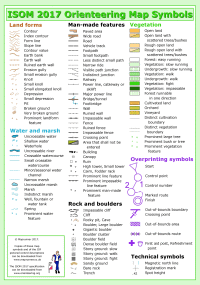
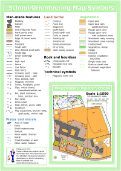
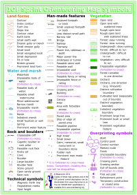

These are downloadable guides to orienteering map symbols. The files are available as jpg images or PDFs and are designed for printing at A4 size. If you are having trouble then try right clicking and select “Save Link As….” (or whatever your browser equivalent is) to copy the file to your computer first.

|Normal (ISOM 2000)|Schools (BOF)|Sprint (ISSOM 2007)|
|:----------------:|:-----------:|:-----------------:|
|The ISOM 2000 map symbols are those used for normal orienteering maps, generally at 1:10,000 or 1:15,000.|The BOF school map symbols are those used for school orienteering maps in Great Britain.|The ISSOM 2007 sprint map symbols are those used for sprint orienteering maps at 1:5,000 or 1:4,000.
||||
|[Download JPG](../resources/Maprunner-schools-map-symbols.jpg)|[Download JPG](../resources/Maprunner-map-symbols.jpg)|[Download JPG](../resources/Maprunner-sprint-map-symbols.jpg)|
|[Download PDF](../resources/Maprunner-schools-map-symbols.pdf)|[Download PDF](../resources/Maprunner-map-symbols.pdf)|[Download PDF](../resources/Maprunner-sprint-map-symbols.PDF)|

Please feel free to distribute these files unchanged or print them out for non-commercial use. Please contact me to discuss any other usage.

The [ISOM 2000 specification](http://orienteering.org/wp-content/uploads/2010/12/International-Specification-for-Orienteering-Maps-2000_2.pdf) and [ISSOM 2007 specification](http://orienteering.org/wp-content/uploads/2010/12/International-Specification-for-Sprint-Orienteering-Maps-2007_corrected-201211.pdf) are available from the [IOF web site](http://orienteering.org/).

The [BOF Specification for School Orienteering Maps](http://www.britishorienteering.org.uk/images/uploaded/downloads/mappers_schoolmappingspecifications.pdf) is available from the [BOF web site](http://www.britishorienteering.org.uk/).

You might also want to download the [Maprunner Guide to IOF Control Descriptions](../iof-control-descriptions/).